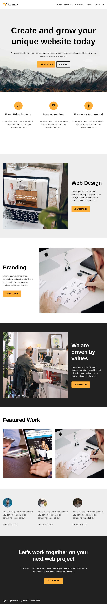
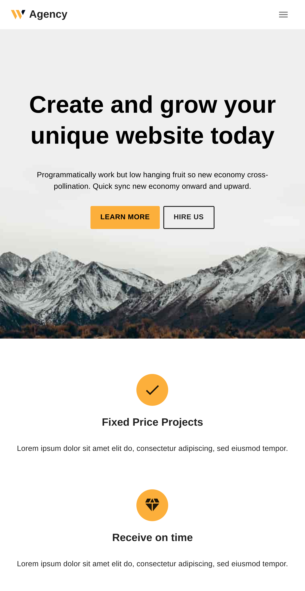
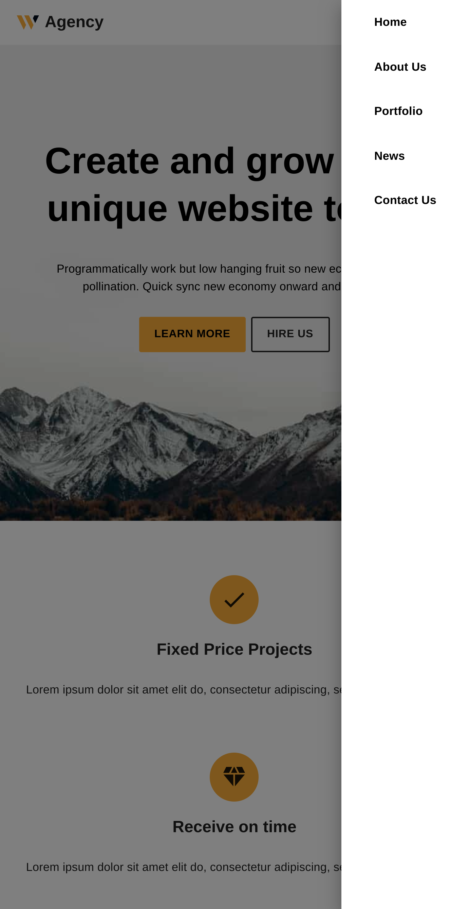

# Web Agency Clone

This is meant for personal and educational purpose only. The solution is heavily inspired by [Web Agency Template](https://themeisle.com/themes/neve/starter-sites/?utm_source=themeisle&utm_medium=product&utm_campaign=themes/neve).

## Screenshots

The implementation supports responsiveness.

## References

- [Material UI](https://mui.com/)
- [Web Agency Template Demo](https://demosites.io/web-agency-gb/)
- [Junior vs Senior React Folder Structure - How To Organize React Projects](https://www.youtube.com/watch?v=UUga4-z7b6s&list=PLQhjK2LZURLFS_pcWmhoaAvoIeRQxj4y1&index=6&ab_channel=WebDevSimplified)
- [Auto Import of React Components in Visual Studio Code [closed]](https://stackoverflow.com/questions/60637561/auto-import-of-react-components-in-visual-studio-code)
